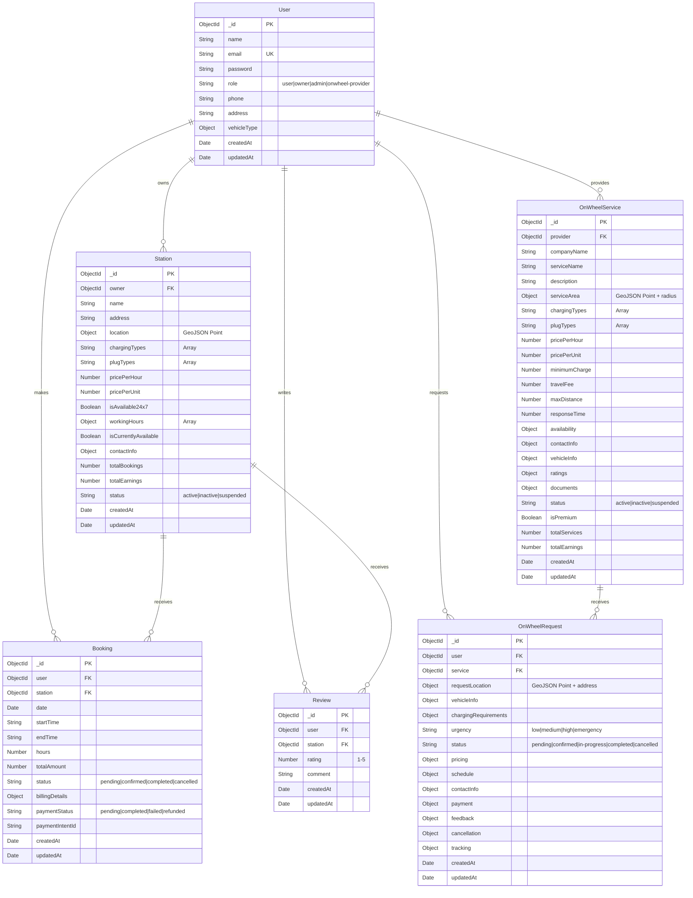

# ER Diagram - EV Charging Station Platform with On-Wheel Services

## Database Schema Overview



## Detailed Entity Descriptions

### 1. User Entity
**Purpose**: Central user management for all platform participants
- **Roles**: Regular users, station owners, admins, on-wheel service providers
- **Key Features**: Authentication, role-based access, profile management

### 2. Station Entity
**Purpose**: Static charging station locations
- **Geospatial**: Location-based queries using GeoJSON
- **Business Logic**: Pricing, availability, capacity management
- **Owner Relationship**: Each station belongs to a user (owner role)

### 3. OnWheelService Entity
**Purpose**: Mobile charging service providers
- **Geospatial**: Service area with radius for coverage
- **Business Logic**: Travel fees, response times, vehicle capacity
- **Provider Relationship**: Each service belongs to a user (onwheel-provider role)

### 4. Booking Entity
**Purpose**: Station charging appointments
- **Time Management**: Date, start/end times, duration
- **Payment Integration**: Stripe payment processing
- **Status Tracking**: Booking lifecycle management

### 5. OnWheelRequest Entity
**Purpose**: Mobile service requests
- **Location Tracking**: Request location with address
- **Service Details**: Vehicle info, charging requirements, urgency
- **Payment Integration**: Stripe payment processing
- **Status Tracking**: Request lifecycle management

### 6. Review Entity
**Purpose**: User feedback for stations
- **Rating System**: 1-5 star ratings with comments
- **Relationship**: Links users to stations they've reviewed

## Key Features

### 🔐 Authentication & Authorization
- JWT-based authentication
- Role-based access control (user, owner, admin, onwheel-provider)
- Secure password handling

### 📍 Geospatial Features
- **Stations**: Fixed locations with GeoJSON Point
- **On-Wheel Services**: Service areas with radius coverage
- **Requests**: Dynamic request locations
- **Queries**: Nearby search, distance calculations

### 💳 Payment Integration
- **Stripe Integration**: Both station bookings and on-wheel requests
- **Payment Intents**: Secure payment processing
- **Status Tracking**: Payment lifecycle management

### 📊 Business Logic
- **Pricing**: Hourly rates, travel fees, minimum charges
- **Availability**: 24/7 flags, working hours, real-time status
- **Capacity**: Vehicle capacity, charging types, plug compatibility

### 🔄 Status Management
- **Bookings**: pending → confirmed → completed/cancelled
- **Requests**: pending → confirmed → in-progress → completed/cancelled
- **Payments**: pending → completed/failed/refunded

## Database Indexes

```javascript
// Geospatial indexes for location-based queries
Station.index({ location: '2dsphere' })
OnWheelService.index({ 'serviceArea': '2dsphere' })
OnWheelRequest.index({ 'requestLocation': '2dsphere' })

// Performance indexes
User.index({ email: 1 })
Booking.index({ user: 1, date: 1 })
OnWheelRequest.index({ user: 1, status: 1 })
Review.index({ station: 1 })
```

## API Endpoints Structure

```
/api/auth/          - Authentication (login, register)
/api/stations/      - Station CRUD operations
/api/bookings/      - Booking management
/api/payment/       - Stripe payment processing
/api/reviews/       - Review management
/api/onwheel-services/    - On-wheel service CRUD
/api/onwheel-requests/    - On-wheel request management
/api/onwheel-payment/     - On-wheel payment processing
/api/admin/         - Admin operations
```

This ER diagram represents a comprehensive EV charging platform that supports both static charging stations and mobile on-wheel charging services, with full payment integration and user management capabilities.
